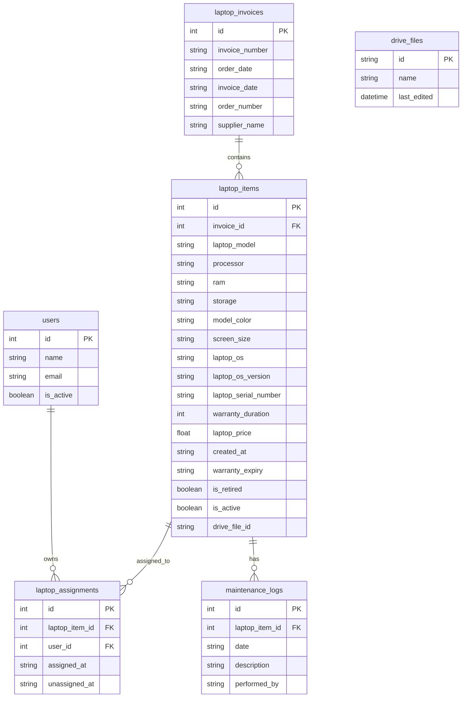

```mermaid
erDiagram

    laptop_invoices ||--o{ laptop_items : contains
    laptop_items ||--o{ laptop_assignments : assigned_to
    users ||--o{ laptop_assignments : owns
    laptop_items ||--o{ maintenance_logs : has

    laptop_invoices {
        int id PK
        string invoice_number
        string order_date
        string invoice_date
        string order_number
        string supplier_name
    }

    laptop_items {
        int id PK
        int invoice_id FK
        string laptop_model
        string processor
        string ram
        string storage
        string model_color
        string screen_size
        string laptop_os
        string laptop_os_version
        string laptop_serial_number
        int warranty_duration
        float laptop_price
        string created_at
        string warranty_expiry
        boolean is_retired
        boolean is_active
        string drive_file_id
    }

    users {
        int id PK
        string name
        string email
        boolean is_active
    }

    laptop_assignments {
        int id PK
        int laptop_item_id FK
        int user_id FK
        string assigned_at
        string unassigned_at
    }

    maintenance_logs {
        int id PK
        int laptop_item_id FK
        string date
        string description
        string performed_by
    }

    drive_files {
        string id PK
        string name
        datetime last_edited
    }
```